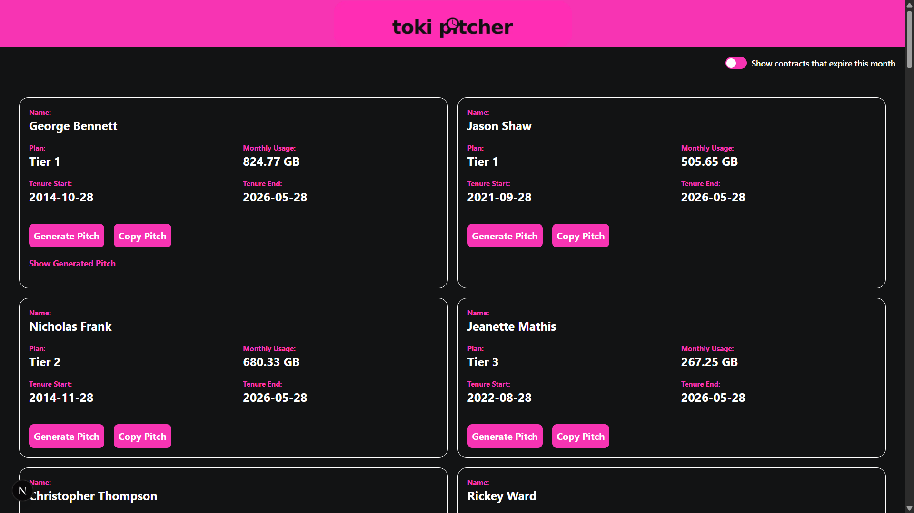

# Toki Pitcher
Toki Pitcher is a retention agent tool for Toki Internet (a made up company) to browse expiring customer contracts and generate personalised recontract pitches using an OpenAI LLM.



## Get Started
* Live Implementation: http://44.200.59.154 (DNS name can take too long to be resolved)
* Demo Video: https://youtu.be/q-TezmCFfdw

## Tech Stack
| Layer | Technology |  
| ----- | ---------- |
| Frontend | Next.JS + TypeScript |
| Styling | TailwindCSS |
| Backend | FastAPI + Python |
| AI Integration | LangChain + OpenAI |
| Database | Supabase |
| Deployment | AWS EC2 |

## Project Structure
```
/
├── frontend/        # Next.js app
│   ├── app/
│   └── components/
├── backend/         # FastAPI
│   ├── main.py
│   └── ai/
|   └── data/
|   └── model/
└── README.md
```

## Synthetic Data: Plans
The broadband plans that can be offered to the customer is created by referring to this source: https://www.time.com.my/, where the plan is named as Tier 1 to Tier 4 from the most expensive to the cheapest plan.

The details of these plans are stored in the database using the following schema:


Since the average montly usage from the user that adopts each plan is not mentioned from the advertisement, it is assumed that the plan is created with the following target customer group in mind:
| Plan | Expected Monthly Usage from the User (GB) |  
| -----| ----------------------------------------- |
| Tier 1 | > 600 |
| Tier 2 | 400 to 600 |
| Tier 3 | 200 to 400 |
| Tier 4 | < 200 |

Even though the expectation may not be accurate, this is considered to be a fair assumption as the broadband provider should have enough data to analyze and identify the general usage behaviour from their customers and able to come up with a similar scheme.

**IMPORTANT**: This expectation will be used as the base to decide whether a user is currently overpaying or underpaying for their currrent plan, and therefore a new plan can be offered for contract renewal which will suit their lifestyle. This is more **reliable** than handing the decision of deciding what new plan to be recommended to the LLM agent which are less predictable and more prone to error.


## Synthetic Data: Customers
This app is currently working on a fake customer dataset that has the following schema:


### Process of Generation
* All the entry value (except pitch) is generated through randomization using `random` and `Faker` (for name generation) and automated via a Python Script.
* The `monthly_usage` and `plan` value are randomized by the following constraint:

| Customer's Current Plan | Possible Range of Value of Monthly Usage (GB) |  
| ----------------------- | --------------------------------------------- |
| Tier 1 | > 500 |
| Tier 2 | 300 to 700 |
| Tier 3 | 100 to 500 |
| Tier 4 | 50 to 300 |

* This constraint is made so that it is possible to have different cases where a customer is convinced to upgrade, downgrade or maintain their plan tier based on the misalignment or alignment of their usage behaviour with the general behaviour observed by the broadband provider.


## Synthetic Data: Summary
| Plan | Expected Monthly Usage from the User (GB) | Possible Range of Value of Monthly Usage (GB) |  
| -----| ----------------------------------------- | --------------------------------------------- |
| Tier 1 | > 600 | > 500 |
| Tier 2 | 400 to 600 | 300 to 700 |
| Tier 3 | 200 to 400 | 100 to 500 |
| Tier 4 | < 200 | 50 to 300 |


## Frontend: Architecture


* ContentHome
    * A **Server Component** that has the primary functions of fetching detail of all 50 customers from the database and pass to its children components as props.
    * The reason why it is created as a Server Component is because a typical Client Component in Next.JS can only interact with external environment via `useEffect` for data fetching which can only take place after first rendering.
    * Server Component bypasses this constraint and allow the operation of fetch data first then render page later.
    * Additionally, this component does not involve any interactivity with the user and therefore is suited as a Server Component.
    * The main idea in developing a Next.JS frontend is that to try to use as little Client Component in as possible to reduce workload on the end user's devices.

* CustomerHome
    * It is the only direct child **Client Component** of Content Home.
    * It houses a **toggle filter** that controls a React State to decide whether should filter the customers data down to those that are going to expire in this month before displaying it.
    * It also houses a grid that will display all customers detail and their interactive component as a card (named as **CustomerBox**) where each customer data will be passed onto an individual CustomerBox as prop.
    * It is necessary to be a Client Component due to the involvement of user's interactivity.
    * In fact, it also serves as a root of all the interactive components in future where it can store all the React state for interactivity and pass down to all the child component that requires it. This can be useful for future expansion without altering the system architecture too drastically.

* CustomerBox
    * This component houses the following components:
        * Customer detail
        * Button to generate pitch
        * Button to copy pitch
        * Button to show / reveal a pitch
    * For the button to generate pitch, when it is clicked, it will send a request to the backend API endpoint (`/api/pitch`) with a body request that contains all the customer details.
        * Since the frontend will handle the customer details, it means that the backend will not need to handle that and will only need to fetch the plan details from the database.
        * Once the backend finished generating the pitch, it will be sent back to the frontend to update the React state of the pitch for this particular customer so it can be displayed immediately.
        * Henceforth, the frontend does not need to hit the database to fetch the latest generated pitch value.
        * The backend will still handle updating the database after generating the pitch to ensure that upon refresh, the generated pitch can still be persisted and displayed on the frontend.


## Backend (`/api/pitch`) : Operation Flow


* The diagram above provides a general overview of how the `/api/pitch` API endpoint operates.
* Based on the monthly usage (GB) of the customer, they will be recommended a plan either to upgrade, downgrade or maintain the plan tier.
* The flow then proceeds to fetch the plan details of the current plan and the recommended renewal plan from database.
* After formatting all the customer and plan data, they are sent as a `HumanMessage` through a `ChatPromptTemplate` to the LLM model.
* For further elaboration, the LLM is implemented as a chain pipeline using `LangChain` that offers the following advantage over using conventional LLM's API endpoint:
    * Easily swapping of models
    * The pipeline created using LangChain Express Language (LCEL) can be expanded and reused easily.
    * Ease of creating conversation history to feed into the LLM models using `ChatPromptTemplate`.
* Additionally, the model also has a `temperature` of 0.2 to generate slightly more creative and personalized pitch.
* Finally, after the pitch has been generated, it is updated into the database and also sent back to the frontend to update the React State.

## System Prompt for LLM Model
```
You are an expert at helping retention agents that work in a broadband provider called Toki Internet by writing personalised recontract pitches for customers whose contracts approach expiry in this month.
You will be provided both the customer information and details regarding their current plan and the plan that the retention agents deem to be suitable for them based on the tracked monthly usage.
The tone of the pitch should be helpful and passionate.
Please pretend that you are speaking to the customer directly and therefore do not attempt to provide follow up message for further assistance to the retention agent.

The pitch should follow the following structure but remain personalised and tailored based on the customer data and not generic:
    1. Start off with a warm message of acknowledging the customer based on their tenure history.
        Example: Hi, <customer_name>! Thanks for being with us at Toki Internet for <x> number of years.
    2. Acknowledge their history of usage
        Example: Based on your usage, you've been averaging X GB a month
    3. Identify the pain or risk
        The plan is named from Tier 1 to Tier 4 where Tier 1 is the highest tier and Tier 4 is the lowest tier. 
        When the retention agents suggest a lower tier plan than the current one, it indicates that the customer is overpaying.
        When the retention agents suggest a higher tier plan than the current one, it indicates that the customer is on a plan that is starting to strain.
        When the same tiered plan is suggested, it indicates that the customer is on a plan that suits they style of using and should continue with it.
        Anchor your pitch based on this.
    4. Anchor with value
        Focus on discussing the perks and monetary value that come with the currently offered plan.
    5. Close with continuity
        Convince the customer to renew the contracts as soon as possible so that they can lock in the rate

The following terminology is helpful for you to explain some terms in more details to the client. 
You must explain these terms clearly when you are going to involve them in your pitch.
1. FTTR: Fibre-To-The-Room
    - Ideal for households with heavy Internet usage on multiple devices, 
    - our expert installers discreetly install transparent optical fibre to designated rooms
    - ensuring minimal disruption to your home's aesthetics.
```

### Human Prompt for LLM Model
```
Customer Information
Name: {customer_name}
Tenure Start Date: {tenure_start}
Tenure End Date: {tenure_end}
Monthly Usage: {monthly_usage} GB


Current Plan Details
Plan Name: {cur_plan_name}
Plan Price: RM {cur_plan_price} per month
Download Speed: {cur_download_speed} Mbps
Upload Speed: {cur_upload_speed} Mbps


Suggested Plan Details:
Plan Name: {new_plan_name}
Plan Price: RM {new_plan_price} per month
Download Speed: {new_download_speed} Mbps
Upload Speed: {new_upload_speed} Mbps
Renew Duration: {new_plan_duration_months} months
Router: {router} router
Mesh Devices Price: {mesh_price}
FTTR Price: {fttr_price}
Promotion: {promotion}
```

## Deployment Architecture: AWS EC2: Elastic Compute Cloud
```
Browser → Nginx (port 80)
            ├── /        → Next.js (port 3000)
            └── /api/    → FastAPI (port 8000)
                              └── OpenAI API
```
* When the deployed website is visited, Nginx intercepts the request, forwards it to the appropriate frontend/backend and returns the result.


## Technical Takeaway: How to Deploy on AWS EC2: Elastic Compute Cloud

### PART 0: Code Setup
1. Since this deployment will makes both the frontend (Next.JS) and backend (FastAPI) sharing the same base URL, the following modifications is suggested on frontend:
```ts
const apiEndpoint = process.env.NEXT_PUBLIC_BACKEND_URL ?? ""
```
* Therefore, in the deployed instance, the environment key `NEXT_PUBLIC_BACKEND_URL` needs not to be set.
* Meanwhile, in local development, by setting it, it still allows the frontend to access the backend.

### PART 1: Launch EC2 Instance
1. Configure:
    * Name: `toki_pitcher`
    * AMI (Amazon Machine Image): Ubuntu LTS
    * Instance type: t2.small (free tier)
        * Recommended because of having 2GB RAM, t2.micro only has 1GB RAM and is not sufficient for this app.
    * Key pair: Create and download the key as `toki_pitcher_key.pem`

2. Under Network Settings --> Edit to add these inbound rules:
    | Type | Port | Source | Purpose |
    | ---- | ---- | ------ | ------- |
    | SSH | 22 | My IP | To connect local device's terminal with the EC2 Instance's terminal |
    | HTTP | 80 | Anywhere | To connect to the rendered application |

3. Launch Instance
    

### PART 2: SSH (Secure Shell) Into The Server
```bash
# On your laptop, restrict key permissions
chmod 400 toki_pitcher_ssh_key.pem

# SSH in
ssh -i toki_pitcher_ssh_key.pem ubuntu@<your-ec2-public-ip>
```

* `chmod` stands for change mode — it controls who can read/write/execute a file on Linux/Mac.
    * The 400 means:
        * 4 = owner can read
        * 0 = group cannot do anything
        * 0 = others cannot do anything

* `-i` stands for identity file — it tells SSH which private key file to use to authenticate


### PART 3: Install Dependencies
```bash
# Update server
sudo apt update && sudo apt upgrade -y

# Install Node.js 20
curl -fsSL https://deb.nodesource.com/setup_20.x | sudo -E bash -
sudo apt install -y nodejs

# Install Python
sudo apt install -y python3

# Install uv
curl -LsSf https://astral.sh/uv/install.sh | sh

# Reload shell so uv is available
source $HOME/.local/bin/env

# Install Git
sudo apt install -y git

# Install Nginx
sudo apt install -y nginx

# Install PM2
sudo npm install -g pm2

# Verify installations
node -v
python3 --version
uv --version
nginx -v
```

### Part 4: Clone Github Repository
```bash
git clone https://github.com/wengti/toki-pitcher.git
cd toki-pitcher
```

### Part 5: Setup FastAPI Backend
1. Install dependencies for the backend and create `.env` file to store environment variables.
```bash
cd backend

# uv will automatically read your pyproject.toml
# and create a virtual environment + install dependencies
uv sync

# Create .env file
nano .env
```

2. Hint on how to save and exit nano
    * Ctrl + X to exit
    * Y to confirm save
    * Enter to confirm the filename

3. Initialize the backend instance by exposing port 8000
```bash
pm2 start "uv run uvicorn main:app --host 0.0.0.0 --port 8000" --name fastapi
```

### Part 6: Setup Next.JS Frontend
1. Create `.env` file and store the frontend's environment variables.
```bash
cd ../frontend

# Create .env
nano .env
```

2. Install, build and start the frontend instance
```bash
npm install
npm run build
pm2 start "npm start" --name nextjs
```

### Part 7: Save PM2 processes
```bash
# Save process list so it survives reboots
pm2 save

# Generate startup script
pm2 startup

# Copy and run the command it outputs
```

### Part 8: Configure Nginx
When a user visits your site, NGINX intercepts the request, forwards it to the appropriate frontend/backend, and returns the result, masking the identity of your internal network.

1. Create the config file to help Nginx decides how to reroute
```bash
sudo nano /etc/nginx/sites-available/toki-pitcher
```

2. Paste the following config:
```
server {
    listen 80;
    server_name <your-ec2-public-ip>;

    location / {
        proxy_pass http://localhost:3000;
    }

    location /api/ {
        proxy_pass http://localhost:8000;
    }
}
```

3. Enable the config
```bash
# Enable your site
sudo ln -s /etc/nginx/sites-available/myapp /etc/nginx/sites-enabled/

# Remove default site
sudo rm /etc/nginx/sites-enabled/default

# Test config is valid
sudo nginx -t

# Restart Nginx
sudo systemctl restart nginx

# Enable Nginx on reboot
sudo systemctl enable nginx
```


### PART 9: Verify Everything Works
```bash
# Check Nginx is running
sudo systemctl status nginx

# Check PM2 processes
pm2 status

# Check backend logs if something is wrong
pm2 logs fastapi

# Check frontend logs if something is wrong
pm2 logs nextjs
```
* Visit the site at `http://<your-ec2-public-ip>`

### PART 10: Deploy Update
```bash
cd toki-pitcher
git pull

# Restart backend
cd backend
uv sync          # picks up any new dependencies from pyproject.toml
pm2 restart fastapi

# Rebuild and restart frontend
cd ../frontend
npm install      # in case dependencies changed
npm run build
pm2 restart nextjs
```

### PART 11: What to pay attention to after stopping and restarting an EC2 instance
1. The public IP address will change.


## Technical Takeaway: Generating Type Schema from Supabase

### TypeScript
1. Follow the following guide is sufficient
    * https://supabase.com/docs/guides/api/rest/generating-types

### Python
1. Follow the following guide for the most part, except for the final step:
    * https://supabase.com/docs/guides/api/rest/generating-python-types

2. Final Step
```bash
npx supabase gen types --lang=python --db-url "<session-pooler-connection-string>" --schema public > model/supabase_model.py
```

## Possible Future Improvement
* Stream the LLM response instead of waiting for full completion
* Add authentication so only agents can access it
* Implement more advanced search and filter functionalities